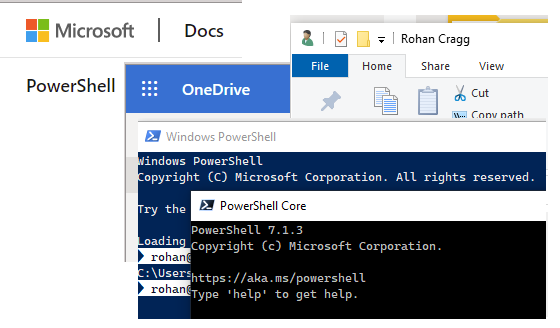

---
title: About PowerShell Module Paths
description: My battle with PowerShell Modules and OneDrive folder backup
hero: My battle with PowerShell Modules and OneDrive folder backup
date: 2021-03-30
authors:
    - Bunkei Ka
og_title: About PowerShell Module Paths
og_description: My battle with PowerShell Modules and OneDrive folder backup
page_path: misc/
og_image: media/ps-module-paths.png
---

This page relates my battle with OneDrive folder backup and how I fixed my broken `$env:PSModulePath`



## The Problem

When trying to use [ConditionalAccessAsCode](https://github.com/AlexFilipin/ConditionalAccess) I ran into a problem with running one of it's dependent modules which is the [AzureADPreview](https://docs.microsoft.com/en-us/powershell/azure/active-directory/install-adv2?view=azureadps-2.0) module (which is only compatible with PowerShell 5.1 and not PowerShell Core (i.e. versions 6 and above))

After running `Install-Module -Name AzureADPreview` **in PowerShell 5.1** I was getting an error running `Import-Module -Name AzureADPreview`:

> The specified module was not loaded because no valid module file was found in any module directory

Which seemed very strange given that it seemed to have installed without error.

After quick [DuckDuckGo](http://duckduckgo.com/) search I got a clue from [this blog article by Salaudeen Rajack](https://www.sharepointdiary.com/2020/01/import-module-specified-module-not-loaded-because-no-valid-module-file-found-in-any-module-directory.html)

I worked out that with `Install-Module` the module was being installed into:
`C:\Users\rohan\OneDrive\Documents\WindowsPowershell\Modules`

..wheras `Import-Module` was trying to load modules from:
`C:\Users\rohan\Documents\WindowsPowershell\Modules`.

I quickly realised that this was because I had enabled the [personal folder backup feature in OneDrive](https://support.microsoft.com/en-us/office/back-up-your-documents-pictures-and-desktop-folders-with-onedrive-d61a7930-a6fb-4b95-b28a-6552e77c3057) and that it had changed the path of my `MyDocuments` folder.

## The Solution(s)

### Update PSModulesPath

As I subsequently discovered, it does state in [this document](https://docs.microsoft.com/en-us/powershell/module/microsoft.powershell.core/about/about_psmodulepath?view=powershell-5.1) on that:

> Microsoft OneDrive can also change the location of your Documents folder. You can verify the location of your Documents folder using the following command: [Environment]::GetFolderPath('MyDocuments').

So the cause of my problem was that the path of my `MyDocuments` folder had been updated form `C:\Users\rohan\Documents` to `C:\Users\rohan\OneDrive\Documents` (after enabling [OneDrive PC folder backup](https://support.microsoft.com/en-us/office/back-up-your-documents-pictures-and-desktop-folders-with-onedrive-d61a7930-a6fb-4b95-b28a-6552e77c3057)), but that the entry for `PSModulePath` in my [User] Environment Variable (in PowerShell `$env:PSModulePath`) had not been updated accordingly.

One solution available to me was to update the value of `PSModulePath` in my [User] Environment Variable to add the `\OneDrive\` segment into the entry for the `MyDocuments` folder


### Disable OneDrive folder backup

If I disable backup then the path can go back to normal and will resolve the issue with `$env:PSModulePath` without having to edit the Environment Variable.

See the section 'Manage or stop PC folder backup' in [this article](https://support.microsoft.com/en-us/office/back-up-your-documents-pictures-and-desktop-folders-with-onedrive-d61a7930-a6fb-4b95-b28a-6552e77c3057)


As it states:

> When you stop backing up a folder, the files that were already backed up by OneDrive stay in the OneDrive folder, and will no longer appear in your device folder.

And so I also then need to move the `Powershell` and `WindowsPowershell` folders back into the MyDocuments folder

### Change the location of OneDrive folder

I'll note this here too as I didn't do this myself and it still won't prevent the issue if you elect to use OneDrive personal folder backup...

[Change the location of your OneDrive folder](https://support.microsoft.com/en-us/office/change-the-location-of-your-onedrive-folder-f386fb81-1461-40a7-be2c-712676b2c4ae)


## A demo of [PSModulePath](https://docs.microsoft.com/en-us/powershell/module/microsoft.powershell.core/about/about_psmodulepath) in action

PowerShell 5 and PowerShell Core download modules into different paths and so I've prepared a couple of demos below to illustrate this.

The full script for the demo is:

=== "CurrentUser"
    ```powershell
    "Running in Powershell $($PSVersionTable.PSVersion.Major).$($PSVersionTable.PSVersion.Minor)"
    $env:PSModulePath
    Install-Module -Name PSLogging -Scope CurrentUser
    Get-InstalledModule
    Get-InstalledModule -Name PSLogging
    Get-Module -Name PSLogging
    Import-Module -Name PSLogging
    Get-Module -Name PSLogging
    (Get-Module -Name PSLogging).Path
    Remove-Module -Name PSLogging
    Uninstall-Module -Name PSLogging
    ```

=== "AllUsers"
    ```powershell
    "Running in Powershell $($PSVersionTable.PSVersion.Major).$($PSVersionTable.PSVersion.Minor)"
    $env:PSModulePath
    # Note: Installing sudo to avoid having to open an elevated shell
    scoop install sudo
    sudo Install-Module -Name PSLogging -Scope AllUsers
    Get-InstalledModule
    Get-InstalledModule -Name PSLogging
    Get-Module -Name PSLogging
    Import-Module -Name PSLogging
    Get-Module -Name PSLogging
    (Get-Module -Name PSLogging).Path
    Remove-Module -Name PSLogging
    sudo Uninstall-Module -Name PSLogging
    ```

[Here's a demo in PowerShell 5.1](https://asciinema.org/a/ZW1bBQsoXBWtYItsl3WSeONJ6):
<script id="asciicast-ZW1bBQsoXBWtYItsl3WSeONJ6" src="https://asciinema.org/a/ZW1bBQsoXBWtYItsl3WSeONJ6.js" async></script>

... and [here's the same demo in PowerShell 7.1](https://asciinema.org/a/uTL9C2ohUBvrBFP3p5krlVToi):
<script id="asciicast-uTL9C2ohUBvrBFP3p5krlVToi" src="https://asciinema.org/a/uTL9C2ohUBvrBFP3p5krlVToi.js" async></script>

